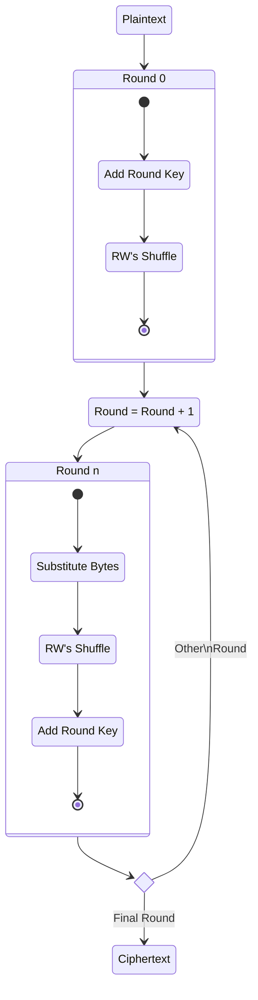
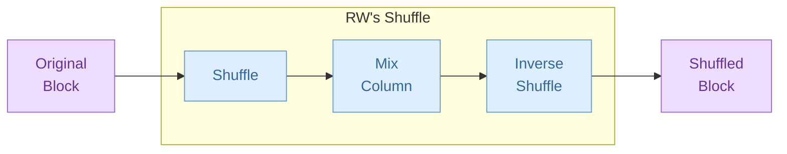
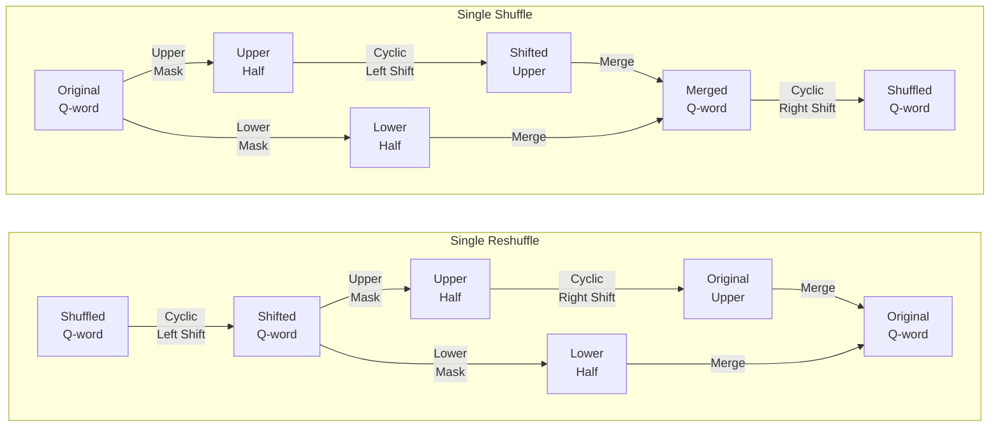

# RichadoWonosas's Symmetric Encryption Version 2 (RWSE2)

**CAUTION:** **This cryptographic algorithm is not in any standard and its security is not yet verified.**

RichadoWonosas's Symmetric Encryption Version 2 (RWSE2) is an encryption algorithm designed by RichadoWonosas. Despite version 2, it is the first published version. The design is deeply affected by *Rijndael*.

## 1. Introduction

RWSE2 is based on the design principle of Substitution-Permutation Network (SPN). RWSE2 is a block cipher with a fixed block size of 256 bits and a key size of 256, 384 or 512 bits.

Bigger key size requires more rounds of operations to achieve stronger security, and the amount of rounds are as follows:

- 12 rounds for 256-bit keys.
- 15 rounds for 384-bit keys.
- 18 rounds for 512-bit keys.

Each round consists of several sub-operations, that includes:

- *Add Round Key* ($RK$): Adding the key of the corresponding round to the block.
- *Substitute Bytes* ($SB$): Use a substitution box (S-box) per byte to make changes to the block.
- *RW's Shuffle* ($SH$): A self-invertible linear transformation, that is, executing $SH$ operation twice in a row to a block results in the original block and equals to nothing happened.

Besides, an *Expand Key* operation is introduced for generating round keys from the original key.

[Section 2](#2-notations-of-the-block) introduces notations of the block of the algorithm. RWSE2's structure is depicted in [Section 3](#3-rwse2s-structure). [Section 4](#4-add-round-key) focuses on Add Round Key operation. In [Section 5](#5-substitute-bytes), we describe the construction about S-box and $SB$ operation. Then, we show the structure of Shuffle operation with the whole linear transformation in [Section 6](#6-rws-shuffle). The Expand Key operation is constructed in [Section 7](#7-expand-key).

## 2. Notations of the Block

RWSE2 has a 256-bit block for encryption or decryption. We use $B$ to represent the block.

$B$ consists of 4 quad-words:

$$
B = \left[
    \begin{matrix}
        q_0\\
        q_1\\
        q_2\\
        q_3\\
    \end{matrix}
\right].
$$

Each quad-word has 8 bytes:

$$
q = \left[
    \begin{matrix}
        b_{0} & b_{1} & b_{2} & b_{3} & b_{4} & b_{5} & b_{6} & b_{7}
    \end{matrix}
    \right].
$$

In other words,

$$
B = \left[
    \begin{matrix}
        b_{0, 0} & b_{0, 1} & b_{0, 2} & b_{0, 3} & b_{0, 4} & b_{0, 5} & b_{0, 6} & b_{0, 7}\\
        b_{1, 0} & b_{1, 1} & b_{1, 2} & b_{1, 3} & b_{1, 4} & b_{1, 5} & b_{1, 6} & b_{1, 7}\\
        b_{2, 0} & b_{2, 1} & b_{2, 2} & b_{2, 3} & b_{2, 4} & b_{2, 5} & b_{2, 6} & b_{2, 7}\\
        b_{3, 0} & b_{3, 1} & b_{3, 2} & b_{3, 3} & b_{3, 4} & b_{3, 5} & b_{3, 6} & b_{3, 7}\\
    \end{matrix}
\right].
$$

Say the value of $q$ is $|q|$, then $|q|$ follows little endian:

$$
|q| = \sum_{j = 0}^{7}{b_{j} \cdot (2^{8})^j}.
$$

In S-box, a byte $b$ is also splitted into 8 bits (We use $d$ for digit to represent bit, preventing from confusing with $b$ for byte):

$$
b = \left[
    \begin{matrix}
        d_0\\
        d_1\\
        d_2\\
        d_3\\
        d_4\\
        d_5\\
        d_6\\
        d_7\\
    \end{matrix}
\right].
$$

## 3. RWSE2's Structure

The whole RWSE2 algorithm has a special 0th round with other rounds:

Encryption and decryption shares the same structure, but decryption uses S-Box Inverse instead of S-Box itself, and some extra operations to the round key will be done. More details are in [Section 7.2](#72-decryption-key-generation).

## 4. Add Round Key

Every round uses 4 quad-words of round key to add round key to the block. Say $rk_i$ is the $i$-th quad-word of all round keys starting from 0th, then the round key for $i$-th round is

$$
R_i = \left[
    \begin{matrix}
        rk_{4i}\\
        rk_{4i+1}\\
        rk_{4i+2}\\
        rk_{4i+3}\\
    \end{matrix}
\right].
$$

So the Add Round Key operation in $i$-th round to the block is

$$
RK_i(B) = B \oplus R_i = \left[
    \begin{matrix}
        q_0 \oplus rk_{4i}\\
        q_1 \oplus rk_{4i+1}\\
        q_2 \oplus rk_{4i+2}\\
        q_3 \oplus rk_{4i+3}\\
    \end{matrix}
\right]
$$

where operation $\oplus$ represents bitwise exclusive or (XOR) operation.

## 5. Substitute Bytes

### 5.1. Substitution Box

A substitution box (S-box) is used to perform the byte-wise substitution. The formula of S-box is

$$
Sb(b) = (A\cdot(\text{0xa4})^b) \oplus (\text{0xe3})
$$

where the power operation defines on Galois Field $\text{GF}(2^8)$ with the primitive polynomial

$$g(x) = x^8 + x^4 + x^3 + x^2 + 1.$$

Specially, define $(\text{0xa4})^{(\text{0xff})} = (\text{0x00})$ because the original value $(\text{0xa4})^{(\text{0xff})} = (\text{0xa4})^{(\text{0x00})} = (\text{0x01})$.

$A$ defines as the following matrix

$$
A = \left[
    \begin{matrix}
        1 & 1 & 0 & 1 & 0 & 0 & 1 & 1\\
        1 & 1 & 1 & 0 & 1 & 0 & 0 & 1\\
        1 & 1 & 1 & 1 & 0 & 1 & 0 & 0\\
        0 & 1 & 1 & 1 & 1 & 0 & 1 & 0\\
        0 & 0 & 1 & 1 & 1 & 1 & 0 & 1\\
        1 & 0 & 0 & 1 & 1 & 1 & 1 & 0\\
        0 & 1 & 0 & 0 & 1 & 1 & 1 & 1\\
        1 & 0 & 1 & 0 & 0 & 1 & 1 & 1\\
    \end{matrix}
\right]
$$

and the multiplication $\cdot$ is a bit-scale matrix multiplication.

The full S-Box and its inverse can be found in [Appendix A](#appendix-a-s-box-and-s-box-inverse).

### 5.2. Substitute Quad-Word

A quad-word consists of 8 bytes. For quad-word $q$, the Substitute Quad-Word operation $Sq$ is to substitute all 8 bytes using S-Box. That is,

$$
\begin{align*}
Sq(q) & = Sq(\left[
    \begin{matrix}
        b_{0} & b_{1} & b_{2} & b_{3} & b_{4} & b_{5} & b_{6} & b_{7}
    \end{matrix}
\right]) \\
& = \left[
    \begin{matrix}
        Sb(b_{0}) & Sb(b_{1}) & Sb(b_{2}) & Sb(b_{3}) & Sb(b_{4}) & Sb(b_{5}) & Sb(b_{6}) & Sb(b_{7})
    \end{matrix}
\right].
\end{align*}
$$

### 5.3. Substitute Bytes

A block consists of 4 quad-words. For the block $B$, the Substitute Bytes operation $SB$ is to substitute all 4 quad-words using Substitute Quad-Word. That is,

$$
\begin{align*}
SB(B) & = SB(\left[
    \begin{matrix}
        q_0\\
        q_1\\
        q_2\\
        q_3\\
    \end{matrix}
\right])\\
& = \left[
    \begin{matrix}
        Sq(q_0)\\
        Sq(q_1)\\
        Sq(q_2)\\
        Sq(q_3)\\
    \end{matrix}
\right]\\
& = \left[
    \begin{matrix}
        Sb(b_{0, 0}) & Sb(b_{0, 1}) & Sb(b_{0, 2}) & Sb(b_{0, 3}) & Sb(b_{0, 4}) & Sb(b_{0, 5}) & Sb(b_{0, 6}) & Sb(b_{0, 7}) \\
        Sb(b_{1, 0}) & Sb(b_{1, 1}) & Sb(b_{1, 2}) & Sb(b_{1, 3}) & Sb(b_{1, 4}) & Sb(b_{1, 5}) & Sb(b_{1, 6}) & Sb(b_{1, 7}) \\
        Sb(b_{2, 0}) & Sb(b_{2, 1}) & Sb(b_{2, 2}) & Sb(b_{2, 3}) & Sb(b_{2, 4}) & Sb(b_{2, 5}) & Sb(b_{2, 6}) & Sb(b_{2, 7}) \\
        Sb(b_{3, 0}) & Sb(b_{3, 1}) & Sb(b_{3, 2}) & Sb(b_{3, 3}) & Sb(b_{3, 4}) & Sb(b_{3, 5}) & Sb(b_{3, 6}) & Sb(b_{3, 7}) \\
    \end{matrix}
\right].
\end{align*}
$$

## 6. RW's Shuffle

RW's Shuffle is a sequence of three basic operations:

1. Shuffle $S$: A permutation that only applies inside quad-words.
2. Mix Column $M$: A matrix multiplication with elements on $\text{GF}(2^8)$, in which the matrix used is self-invertible.
3. Reshuffle $S^{-1}$: The inverse of Shuffle $S$.

So the RW's Shuffle is defined as

$$
SH(B) = S^{-1}(M(S(B))).
$$

The following chart shows the structure of RW's Shuffle.

### 6.1. Single Shuffle/Reshuffle Operation

Two constants used for shuffle operation: Upper Mask $u = \text{0x9292929292929292}$ and Lower Mask $l = \text{0x6d6d6d6d6d6d6d6d}$. They satisfy:

1. $u \oplus l = \text{0xffffffffffffffff} = (\underbrace{111 \dots 11}_{64})_2$.
2. $u \lll 8 = u$, $u \ggg 8 = u$, $l \lll 8 = l$, $l \ggg 8 = l$, where $\lll$ and $\ggg$ represents cyclic left and right shift of quad-word.

The single shuffle operation $s$ operates on quad-word, and receive two more parameters: $sd$ for digits to shift, $so$ for shuffle operation. $s$ is as follows:

$$
s(q, sd, so) = ((q \land u) \lll (8 \cdot so) \oplus (q \land l)) \ggg sd
$$

where $\land$ stands for bitwise and (AND) operation.

The single reshuffle operation, the inverse of the single shuffle operation, is defined as follows:

$$
s^{-1}(q, sd, so) = ((q \lll sd) \land u) \ggg (8 \cdot so) \oplus ((q \lll sd) \land l).
$$

The following charts show the procedure of a single shuffle operation:

### 6.2. Shuffle/Reshuffle

Shuffle operation is defined as

$$
S(B) = S(\left[
    \begin{matrix}
        q_0\\
        q_1\\
        q_2\\
        q_3\\
    \end{matrix}
\right]) = \left[
    \begin{matrix}
        s(q_0, 5, 1)\\
        s(q_1, 23, 3)\\
        s(q_2, 41, 5)\\
        s(q_3, 59, 7)\\
    \end{matrix}
\right],
$$

with Reshuffle operation defined as

$$
S^{-1}(B) = S^{-1}(\left[
    \begin{matrix}
        q_0\\
        q_1\\
        q_2\\
        q_3\\
    \end{matrix}
\right]) = \left[
    \begin{matrix}
        s^{-1}(q_0, 5, 1)\\
        s^{-1}(q_1, 23, 3)\\
        s^{-1}(q_2, 41, 5)\\
        s^{-1}(q_3, 59, 7)\\
    \end{matrix}
\right].
$$

### 6.3. Mix Column

The Mix Column operation $M$ is as follows:

$$
\begin{align*}
M(B) & = X \cdot B\\
& = \left[
    \begin{matrix}
        03 & 01 & 02 & 01\\
        01 & 03 & 01 & 02\\
        02 & 01 & 03 & 01\\
        01 & 02 & 01 & 03\\
    \end{matrix}
\right] \cdot \left[
    \begin{matrix}
        b_{0, 0} & b_{0, 1} & b_{0, 2} & b_{0, 3} & b_{0, 4} & b_{0, 5} & b_{0, 6} & b_{0, 7}\\
        b_{1, 0} & b_{1, 1} & b_{1, 2} & b_{1, 3} & b_{1, 4} & b_{1, 5} & b_{1, 6} & b_{1, 7}\\
        b_{2, 0} & b_{2, 1} & b_{2, 2} & b_{2, 3} & b_{2, 4} & b_{2, 5} & b_{2, 6} & b_{2, 7}\\
        b_{3, 0} & b_{3, 1} & b_{3, 2} & b_{3, 3} & b_{3, 4} & b_{3, 5} & b_{3, 6} & b_{3, 7}\\
    \end{matrix}
\right].
\end{align*}
$$

Each byte represents an element on $\text{GF}(2^8)$, so the multiplication and addition for each element follows the ones on $\text{GF}(2^8)$.

The matrix

$$
X = \left[
    \begin{matrix}
        03 & 01 & 02 & 01\\
        01 & 03 & 01 & 02\\
        02 & 01 & 03 & 01\\
        01 & 02 & 01 & 03\\
    \end{matrix}
\right]
$$

is a self-invertible matrix, that is,

$$
X^2 = \left[
    \begin{matrix}
        03 & 01 & 02 & 01\\
        01 & 03 & 01 & 02\\
        02 & 01 & 03 & 01\\
        01 & 02 & 01 & 03\\
    \end{matrix}
\right] \cdot \left[
    \begin{matrix}
        03 & 01 & 02 & 01\\
        01 & 03 & 01 & 02\\
        02 & 01 & 03 & 01\\
        01 & 02 & 01 & 03\\
    \end{matrix}
\right] = \left[
    \begin{matrix}
        01 & 00 & 00 & 00\\
        00 & 01 & 00 & 00\\
        00 & 00 & 01 & 00\\
        00 & 00 & 00 & 01\\
    \end{matrix}
\right] = I.
$$

So the Mix Column operation satisfies that

$$
M(M(B)) = X \cdot X \cdot B = B,
$$

that is, the Mix Column operation is self-invertible.

### 6.4. RW's Shuffle's Self-Invertibility

RW's Shuffle $SH$ is self-invertible, because

$$
\begin{align*}
SH(SH(B)) & = S^{-1}(M(S(S^{-1}(M(S(B)))))) \\
& = S^{-1}(M(M(S(B)))) \\
& = S^{-1}(S(B)) \\
& = B.
\end{align*}
$$

## 7. Expand Key

The Expand Key operation is to expand the inputted key into round keys. Notations of round keys are in [Section 4](#4-add-round-key).

For key length of 256/384/512 bits, say the key constant

$$
nk = \left\lbrace
    \begin{align*}
    4,\ & \text{key length = 256 bits} \\
    6,\ & \text{key length = 384 bits} \\
    8,\ & \text{key length = 512 bits} \\
    \end{align*}
\right.,
$$

and the amount of rounds

$$
r = \left\lbrace
    \begin{align*}
    12,\ & \text{key length = 256 bits} \\
    15,\ & \text{key length = 384 bits} \\
    18,\ & \text{key length = 512 bits} \\
    \end{align*}
\right..
$$

To protect the inputted key, a sequence of round constants is defined in bytes ($rc$) and in quad-words ($rcon$):

$$
\begin{align*}
rc_i &= (02)_{16}^{i} \text{ in GF} (2^8), \\
rcon_i &= \left[
    \begin{matrix}
        rc_{8i} & rc_{8i + 1} & rc_{8i + 2} & rc_{8i + 3} & rc_{8i + 4} & rc_{8i + 5} & rc_{8i + 6} & rc_{8i + 7} \\
    \end{matrix}
\right].
\end{align*}
$$

### 7.1. Encryption Key Generation

Let $k_i$ be the $i$-th quad-word of the inputted key. As $rk_i$ represents $i$-th quad-word of all round keys, we can derive round keys using following operations:

$$
rk_i = \left\lbrace
    \begin{align*}
        & k_i, && \text{if } 0 \leqslant i < nk ,\\
        & rk_{i - nk} \oplus Sq(s(rk_{i - 1}, 25, 4)) \oplus rcon_{(i / nk) - 1}, && \text{if } nk \leqslant i < 4(r + 1) \text{ and } i \equiv 0 \ (\text{mod } nk),\\
        & rk_{i - nk} \oplus Sq(rk_{i - 1}), && \text{if } nk \leqslant i < 4(r + 1) \text{ and } i \equiv \frac{nk}{2} \ (\text{mod } nk),\\
        & rk_{i - nk} \oplus rk_{i - 1}, && \text{otherwise}.\\
    \end{align*}
\right.
$$

In which $Sq$ is the Substitute Quad-Word operation defined in [Section 5.2](#52-substitute-quad-word) and $s$ is the Single Shuffle operation defined in [Section 6.1](#61-single-shufflereshuffle-operation).

### 7.2. Decryption Key Generation

If the decryption structure is the same as the encryption structure depicted in [Section 3](#3-rwse2s-structure), then the order of $SH$ and $RK$ is reversed in all rounds except 0th round and the last round. Besides changing the order of round key blocks $R_i$ used, an additional operation should be used.

Because $SH$ is a linear function, it can be easily proven that

$$
SH(B \oplus R_i) = SH(B) \oplus SH(R_i).
$$

Because $SH$ is self-invertible, the decryption key of $i$-th round

$$
R_i' = \left\lbrace
    \begin{align*}
        & R_{r - i}, && \text{ if } i = 0 \text{ or } i = r,\\
        & SH(R_{r - i}), && \text{ otherwise}.\\
    \end{align*}
\right.
$$

## Appendix A. S-Box and S-Box Inverse

**S-Box**:

||**_0**|**_1**|**_2**|**_3**|**_4**|**_5**|**_6**|**_7**|**_8**|**_9**|**_a**|**_b**|**_c**|**_d**|**_e**|**_f**|
|-|-|-|-|-|-|-|-|-|-|-|-|-|-|-|-|-|
|**0_**|28|50|a7|91|08|8f|2c|61|d6|a3|a0|79|bd|84|97|47|
|**1_**|46|e1|9d|5b|1c|b7|98|cd|11|43|77|90|af|f3|ea|26|
|**2_**|7d|8c|f5|a5|ef|b0|70|78|1a|f8|51|00|ed|ce|c8|87|
|**3_**|4e|83|7f|f2|4d|5a|bb|cb|5e|8a|ba|6c|22|4c|fd|c7|
|**4_**|0d|19|21|95|39|fe|1e|c9|20|32|45|38|59|62|0f|67|
|**5_**|99|6a|6d|85|30|3b|80|a6|36|74|49|6b|ca|f9|f6|7c|
|**6_**|2b|89|63|a8|1b|5f|2d|c6|aa|65|e7|d2|92|d1|4b|15|
|**7_**|72|06|a2|07|05|7b|c3|3c|68|13|3d|cf|6f|fb|88|c4|
|**8_**|d4|dd|18|86|e9|ff|b9|b5|e6|75|ee|17|0c|be|5d|53|
|**9_**|7e|55|31|9c|fc|60|71|df|66|3e|16|ab|c2|9b|14|d5|
|**a_**|7a|64|40|ae|54|96|e0|3a|27|da|f0|33|e2|44|9f|25|
|**b_**|a4|48|cc|b6|3f|b1|d7|04|dc|bf|fa|2f|b8|12|9a|b3|
|**c_**|a9|bc|23|eb|81|01|4a|b2|0e|c0|e5|ac|2a|2e|1f|6e|
|**d_**|5c|f4|02|93|76|37|d3|35|ad|8d|52|d9|29|f7|db|57|
|**e_**|4f|24|03|34|0a|f1|94|9e|82|d8|8e|8b|1d|10|e4|0b|
|**f_**|56|e8|58|c5|73|a1|de|c1|42|d0|ec|69|b4|41|09|e3|

**S-Box Inverse**:

||**_0**|**_1**|**_2**|**_3**|**_4**|**_5**|**_6**|**_7**|**_8**|**_9**|**_a**|**_b**|**_c**|**_d**|**_e**|**_f**|
|-|-|-|-|-|-|-|-|-|-|-|-|-|-|-|-|-|
|**0_**|2b|c5|d2|e2|b7|74|71|73|04|fe|e4|ef|8c|40|c8|4e|
|**1_**|ed|18|bd|79|9e|6f|9a|8b|82|41|28|64|14|ec|46|ce|
|**2_**|48|42|3c|c2|e1|af|1f|a8|00|dc|cc|60|06|66|cd|bb|
|**3_**|54|92|49|ab|e3|d7|58|d5|4b|44|a7|55|77|7a|99|b4|
|**4_**|a2|fd|f8|19|ad|4a|10|0f|b1|5a|c6|6e|3d|34|30|e0|
|**5_**|01|2a|da|8f|a4|91|f0|df|f2|4c|35|13|d0|8e|38|65|
|**6_**|95|07|4d|62|a1|69|98|4f|78|fb|51|5b|3b|52|cf|7c|
|**7_**|26|96|70|f4|59|89|d4|1a|27|0b|a0|75|5f|20|90|32|
|**8_**|56|c4|e8|31|0d|53|83|2f|7e|61|39|eb|21|d9|ea|05|
|**9_**|1b|03|6c|d3|e6|43|a5|0e|16|50|be|9d|93|12|e7|ae|
|**a_**|0a|f5|72|09|b0|23|57|02|63|c0|68|9b|cb|d8|a3|1c|
|**b_**|25|b5|c7|bf|fc|87|b3|15|bc|86|3a|36|c1|0c|8d|b9|
|**c_**|c9|f7|9c|76|7f|f3|67|3f|2e|47|5c|37|b2|17|2d|7b|
|**d_**|f9|6d|6b|d6|80|9f|08|b6|e9|db|a9|de|b8|81|f6|97|
|**e_**|a6|11|ac|ff|ee|ca|88|6a|f1|84|1e|c3|fa|2c|8a|24|
|**f_**|aa|e5|33|1d|d1|22|5e|dd|29|5d|ba|7d|94|3e|45|85|

## Appendix B. Trivia

- The matrix $A$ used in [Section 5.1](#51-substitution-box) is a circulant matrix generated from value 0xd3, which is the product of 'R' (0x52) and 'W' (0x57) on Galois Field $\text{GF}(2^8)$.

- The constant value 0xa4 used in [Section 5.1](#51-substitution-box) represents the sum of hex value of string "RichadoWonosas", which is exactly 0x5a4.

- Another constant value 0xe3 used in [Section 5.1](#51-substitution-box) is chosen to make the S-Box a cyclic permutation.

- The Upper Mask $u$ used in [Section 6.1](#61-single-shufflereshuffle-operation) is inspired from a certain rhythm type.

- The four digits-to-shifts set in [Section 6.2](#62-shufflereshuffle) (5, 23, 41, 59) form an arithmetic progression with all elements are prime number, and the average of them is 32, half of the bit amount of quad-word.

- The matrix $X$ used in [Section 6.3](#63-mix-column) is the 27th candidate of all small-index self-invertible matrices generated by ascending exhaustive search.
