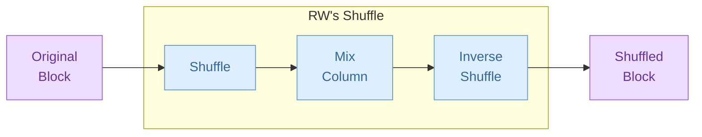

# RichadoWonosas's Symmetric Encryption Version 2 (RWSE2)

**CAUTION:** **This cryptographic algorithm is not in any standard and its security is not yet verified.**

RichadoWonosas's Symmetric Encryption Version 2 (RWSE2) is an encryption algorithm designed by RichadoWonosas. Despite version 2, it is the first published version. The design is deeply affected by *Rijndael*.

## 1. Introduction

RWSE2 is based on the design principle of Substitution-Permutation Network (SPN). RWSE2 is a block cipher with a fixed block size of 256 bits and a key size of 256, 384 or 512 bits.

Bigger key size requires more rounds of operations to achieve stronger security, and the number of rounds are as follows:

- 12 rounds for 256-bit keys.
- 15 rounds for 384-bit keys.
- 18 rounds for 512-bit keys.

Each round consists of several sub-operations, that includes:

- *Add Round Key* ($RK$): Adding the key of the corresponding round to the block.
- *Substitute Bytes* ($SB$): Use a substitution box (S-box) per byte to make changes to the block.
- *RW's Shuffle* ($SH$): A self-invertible linear transformation, that is, executing $SH$ operation twice in a row to a block results in the original block and equals to nothing happened.

Besides, an *Expand Key* operation is introduced for generating round keys from the original key.

[Section 2](#2-notations) introduces notations used in this article. [Section 3](#3-add-round-key) focuses on Add Round Key operation. In [Section 4](#4-substitute-bytes), we describe the construction about S-box and $SB$ operation. Then, we show the structure of Shuffle operation with the whole linear transformation in [Section 5](#5-rws-shuffle). The Expand Key operation is constructed in [Section 6](#6-expand-key).

## 2. Notations

RWSE2 has a 256-bit block for encryption or decryption. We use $B$ to represent the block.

$B$ consists of 4 quad-words:
$$
B = \left[
    \begin{matrix}
        q_0\\
        q_1\\
        q_2\\
        q_3\\
    \end{matrix}
\right].
$$

Each quad-word has 8 bytes:
$$
q = \left[
    \begin{matrix}
        b_{0} & b_{1} & b_{2} & b_{3} & b_{4} & b_{5} & b_{6} & b_{7}
    \end{matrix}
    \right].
$$

In other words,
$$
B = \left[
    \begin{matrix}
        b_{0, 0} & b_{0, 1} & b_{0, 2} & b_{0, 3} & b_{0, 4} & b_{0, 5} & b_{0, 6} & b_{0, 7}\\
        b_{1, 0} & b_{1, 1} & b_{1, 2} & b_{1, 3} & b_{1, 4} & b_{1, 5} & b_{1, 6} & b_{1, 7}\\
        b_{2, 0} & b_{2, 1} & b_{2, 2} & b_{2, 3} & b_{2, 4} & b_{2, 5} & b_{2, 6} & b_{2, 7}\\
        b_{3, 0} & b_{3, 1} & b_{3, 2} & b_{3, 3} & b_{3, 4} & b_{3, 5} & b_{3, 6} & b_{3, 7}\\
    \end{matrix}
\right].
$$

Say the value of $q$ is $|q|$, then $|q|$ follows little endian:
$$
|q| = \sum_{j = 0}^{7}{b_{j} \cdot (2^{8})^j}.
$$

In S-box, a byte $b$ is also splitted into 8 bits (We use $d$ for digit to represent bit, preventing from confusing with $b$ for byte):
$$
b = \left[
    \begin{matrix}
        d_0\\
        d_1\\
        d_2\\
        d_3\\
        d_4\\
        d_5\\
        d_6\\
        d_7\\
    \end{matrix}
\right].
$$

## 3. Add Round Key

Every round uses 4 quad-words of round key to add round key to the block. Say $rk_i$ is the $i$-th quad-word of all round keys starting from 0th, then the round key for $i$-th round is
$$
R_i = \left[
    \begin{matrix}
        rk_{4i}\\
        rk_{4i+1}\\
        rk_{4i+2}\\
        rk_{4i+3}\\
    \end{matrix}
\right].
$$

So the Add Round Key operation in $i$-th round to the block is
$$
RK_i(B) = B \oplus R_i = \left[
    \begin{matrix}
        q_0 \oplus rk_{4i}\\
        q_1 \oplus rk_{4i+1}\\
        q_2 \oplus rk_{4i+2}\\
        q_3 \oplus rk_{4i+3}\\
    \end{matrix}
\right]
$$
where operation $\oplus$ represents bitwise exclusive or (XOR) operation.

## 4. Substitute Bytes

### 4.1. Substitution Box

A substitution box (S-box) is used to perform the byte-wise substitution. The formula of S-box is
$$
Sb(b) = (A\cdot(\text{0xa4})^b) \oplus (\text{0xe3})
$$

where the power operation defines on Galois Field $\text{GF}(2^8)$ with the primitive polynomial
$$g(x) = x^8 + x^4 + x^3 + x^2 + 1.$$

Specially, define $(\text{0xa4})^{(\text{0xff})} = (\text{0x00})$ because the original value $(\text{0xa4})^{(\text{0xff})} = (\text{0xa4})^{(\text{0x00})} = (\text{0x01})$.

$A$ defines as the following matrix
$$
A = \left[
    \begin{matrix}
        1 & 1 & 0 & 1 & 0 & 0 & 1 & 1\\
        1 & 1 & 1 & 0 & 1 & 0 & 0 & 1\\
        1 & 1 & 1 & 1 & 0 & 1 & 0 & 0\\
        0 & 1 & 1 & 1 & 1 & 0 & 1 & 0\\
        0 & 0 & 1 & 1 & 1 & 1 & 0 & 1\\
        1 & 0 & 0 & 1 & 1 & 1 & 1 & 0\\
        0 & 1 & 0 & 0 & 1 & 1 & 1 & 1\\
        1 & 0 & 1 & 0 & 0 & 1 & 1 & 1\\
    \end{matrix}
\right]
$$

and the multiplication $\cdot$ is a bit-scale matrix multiplication.

### 4.2. Substitute Quad-Word

A quad-word consists of 8 bytes. For quad-word $q$, the Substitute Quad-Word operation $Sq$ is to substitute all 8 bytes using S-Box. That is,

$$
\begin{align*}
Sq(q) & = Sq(\left[
    \begin{matrix}
        b_{0} & b_{1} & b_{2} & b_{3} & b_{4} & b_{5} & b_{6} & b_{7}
    \end{matrix}
\right]) \\
& = \left[
    \begin{matrix}
        Sb(b_{0}) & Sb(b_{1}) & Sb(b_{2}) & Sb(b_{3}) & Sb(b_{4}) & Sb(b_{5}) & Sb(b_{6}) & Sb(b_{7})
    \end{matrix}
\right].
\end{align*}
$$

### 4.3. Substitute Bytes

A block consists of 4 quad-words. For the block $B$, the Substitute Bytes operation $SB$ is to substitute all 4 quad-words using Substitute Quad-Word. That is,

$$
\begin{align*}
SB(B) & = SB(\left[
    \begin{matrix}
        q_0\\
        q_1\\
        q_2\\
        q_3\\
    \end{matrix}
\right])\\
& = \left[
    \begin{matrix}
        Sq(q_0)\\
        Sq(q_1)\\
        Sq(q_2)\\
        Sq(q_3)\\
    \end{matrix}
\right]\\
& = \left[
    \begin{matrix}
        Sb(b_{0, 0}) & Sb(b_{0, 1}) & Sb(b_{0, 2}) & Sb(b_{0, 3}) & Sb(b_{0, 4}) & Sb(b_{0, 5}) & Sb(b_{0, 6}) & Sb(b_{0, 7}) \\
        Sb(b_{1, 0}) & Sb(b_{1, 1}) & Sb(b_{1, 2}) & Sb(b_{1, 3}) & Sb(b_{1, 4}) & Sb(b_{1, 5}) & Sb(b_{1, 6}) & Sb(b_{1, 7}) \\
        Sb(b_{2, 0}) & Sb(b_{2, 1}) & Sb(b_{2, 2}) & Sb(b_{2, 3}) & Sb(b_{2, 4}) & Sb(b_{2, 5}) & Sb(b_{2, 6}) & Sb(b_{2, 7}) \\
        Sb(b_{3, 0}) & Sb(b_{3, 1}) & Sb(b_{3, 2}) & Sb(b_{3, 3}) & Sb(b_{3, 4}) & Sb(b_{3, 5}) & Sb(b_{3, 6}) & Sb(b_{3, 7}) \\
    \end{matrix}
\right].
\end{align*}
$$

## 5. RW's Shuffle

RW's Shuffle is a sequence of three basic operations:

1. Shuffle $S$: A permutation that only applies inside quad-words.
2. Mix Column $M$: A matrix multiplication with elements on $\text{GF}(2^8)$, in which the matrix used is self-invertible.
3. Reshuffle $S^{-1}$: The inverse of Shuffle $S$.

So the RW's Shuffle is defined as
$$
SH(B) = S^{-1}(M(S(B))).
$$

The following chart shows the structure of RW's Shuffle.

### 5.1. Single Shuffle/Reshuffle Operation

Two constants used for shuffle operation: Upper Mask $u = \text{0x9292929292929292}$ and Lower Mask $l = \text{0x6d6d6d6d6d6d6d6d}$. They satisfy:

1. $u \oplus l = \text{0xffffffffffffffff} = (\underbrace{111 \dots 11}_{128})_2$.
2. $\left\lbrace\begin{matrix}u \lll 8 = u \\ u \ggg 8 = u \end{matrix}\right.$, $\left\lbrace\begin{matrix}l \lll 8 = l \\ l \ggg 8 = l \end{matrix}\right.$, where $\lll$ and $\ggg$ represents circular left and right shift of quad-word.

The single shuffle operation $s$ operates on quad-word, and receive two more parameters: $sd$ for digits to shift, $so$ for shuffle operation. $s$ is as follows:
$$
s(q, sd, so) = ((q \land u) \lll (8 \cdot so) \oplus (q \land l)) \ggg sd
$$
where $\land$ stands for bitwise and (AND) operation.

The single reshuffle operation, the inverse of the single shuffle operation, is defined as follows:
$$
s^{-1}(q, sd, so) = ((q \lll sd) \land u) \ggg (8 \cdot so) \oplus ((q \lll sd) \land l).
$$

The following charts show the procedure of a single shuffle operation:

### 5.2. Shuffle/Reshuffle

Shuffle operation is defined as
$$
S(B) = S(\left[
    \begin{matrix}
        q_0\\
        q_1\\
        q_2\\
        q_3\\
    \end{matrix}
\right]) = \left[
    \begin{matrix}
        s(q_0, 5, 1)\\
        s(q_1, 23, 3)\\
        s(q_2, 41, 5)\\
        s(q_3, 59, 7)\\
    \end{matrix}
\right],
$$

with Reshuffle operation defined as
$$
S^{-1}(B) = S^{-1}(\left[
    \begin{matrix}
        q_0\\
        q_1\\
        q_2\\
        q_3\\
    \end{matrix}
\right]) = \left[
    \begin{matrix}
        s^{-1}(q_0, 5, 1)\\
        s^{-1}(q_1, 23, 3)\\
        s^{-1}(q_2, 41, 5)\\
        s^{-1}(q_3, 59, 7)\\
    \end{matrix}
\right].
$$

### 5.3. Mix Column

The Mix Column operation $M$ is as follows:
$$
\begin{align*}
M(B) & = X \cdot B\\
& = \left[
    \begin{matrix}
        03 & 01 & 02 & 01\\
        01 & 03 & 01 & 02\\
        02 & 01 & 03 & 01\\
        01 & 02 & 01 & 03\\
    \end{matrix}
\right] \cdot \left[
    \begin{matrix}
        b_{0, 0} & b_{0, 1} & b_{0, 2} & b_{0, 3} & b_{0, 4} & b_{0, 5} & b_{0, 6} & b_{0, 7}\\
        b_{1, 0} & b_{1, 1} & b_{1, 2} & b_{1, 3} & b_{1, 4} & b_{1, 5} & b_{1, 6} & b_{1, 7}\\
        b_{2, 0} & b_{2, 1} & b_{2, 2} & b_{2, 3} & b_{2, 4} & b_{2, 5} & b_{2, 6} & b_{2, 7}\\
        b_{3, 0} & b_{3, 1} & b_{3, 2} & b_{3, 3} & b_{3, 4} & b_{3, 5} & b_{3, 6} & b_{3, 7}\\
    \end{matrix}
\right].
\end{align*}
$$

Each byte represents an element on $\text{GF}(2^8)$, so the multiplication and addition for each element follows the ones on $\text{GF}(2^8)$.

The matrix $X = \left[
    \begin{matrix}
        03 & 01 & 02 & 01\\
        01 & 03 & 01 & 02\\
        02 & 01 & 03 & 01\\
        01 & 02 & 01 & 03\\
    \end{matrix}
\right]$ is a self-invertible matrix, that is,
$$
X^2 = \left[
    \begin{matrix}
        03 & 01 & 02 & 01\\
        01 & 03 & 01 & 02\\
        02 & 01 & 03 & 01\\
        01 & 02 & 01 & 03\\
    \end{matrix}
\right] \cdot \left[
    \begin{matrix}
        03 & 01 & 02 & 01\\
        01 & 03 & 01 & 02\\
        02 & 01 & 03 & 01\\
        01 & 02 & 01 & 03\\
    \end{matrix}
\right] = \left[
    \begin{matrix}
        01 & 00 & 00 & 00\\
        00 & 01 & 00 & 00\\
        00 & 00 & 01 & 00\\
        00 & 00 & 00 & 01\\
    \end{matrix}
\right] = I.
$$

So the Mix Column operation satisfies that
$$
M(M(B)) = X \cdot X \cdot B = B,
$$
that is, the Mix Column operation is self-invertible.

### 5.4. RW's Shuffle's Self-Invertibility

RW's Shuffle $SH$ is self-invertible, because

$$
\begin{align*}
SH(SH(B)) & = S^{-1}(M(S(S^{-1}(M(S(B)))))) \\
& = S^{-1}(M(M(S(B)))) \\
& = S^{-1}(S(B)) \\
& = B.
\end{align*}
$$

## 6. Expand Key
